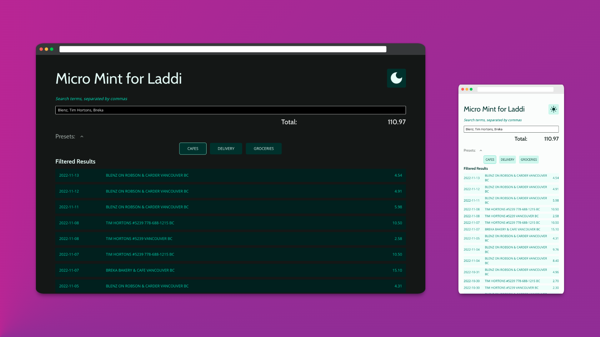
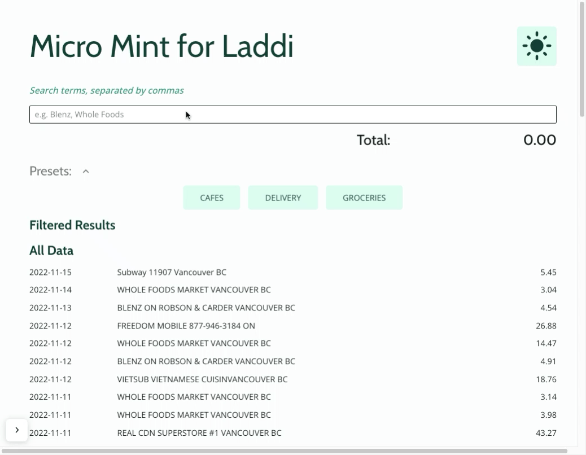

<h1 align="center">Micro Mint</h1>



<p align="center">
Filter and sum transaction statements for easy spending analysis
</p>

## Description
This is a simple and private alternative to a full-featured budgeting application like Mint (and might be all you need!) Upload a CSV-formatted transaction statement and filter by transaction descriptions to track different kinds of spending.

I made this for my partner to use with Vancity statements, which have no header row and show transaction dates, descriptions, and amounts in the 3rd, 5th, and 7th columns respectively. If your bank provides similarly formatted statements feel free to use it as is. Or see below for customizations.


## Demo



# Usage
Upload a CSV-formatted statement and start filtering by typing in the search bar. You can sum as many sources as you like by separating with comma + space `, `.

## Privacy
There is no backend and no database to this app. The parsed array is saved in your browser's local storage. If you are using a Vancity-style statement, that array only contains the dates, transaction descriptions, and debit amounts. You may still wish to upload an anonymized version of your statement -- it won't affect the app.

Clear local storage with the `Clear All Data` button at the bottom of the page.


## Customization
Preset buttons are defined in `/src/data/initialPresets`.

Which CSV columns to process are defined in `/src/hooks/useCsvParse.ts`


## Getting Started
Easiest is to use the [live site hosted on GitHub Pages](https://kathyavini.github.io/micro-mint/).

To instead run it locally:
```
git clone https://github.com/kathyavini/micro-mint.git
cd micro-mint
npm install
npm run dev
```

## Features
- Light and dark mode
- Mobile-responsive
- Private -- no login, no backend, no database


## Technologies used
- [React](https://reactjs.org/)
- [Typescript](https://www.typescriptlang.org/)
- [Vite](https://vitejs.dev/)
- [Vanilla Extract](https://vanilla-extract.style/) Zero-runtime stylesheets in TypeScript
- [Radix UI Primitives](https://www.radix-ui.com/) Low-level UI component library with a focus on accessibility, customization and developer experience

CSV upload and parsing are done with native JavaScript (no libraries).


## Roadmap
I put this together in an evening without much thought to extensibility. We've found it pretty useful, though, so I might return to it at some point to add:
- creating and managing presets from within the UI
- customizing CSV parsing to suit statements from other banks
- option to combine multiple statements into the data array

## Contributing
Please feel free to [open an issue](https://github.com/kathyavini/micro-mint/issues/new) if you'd like to address on the above, or anything else!